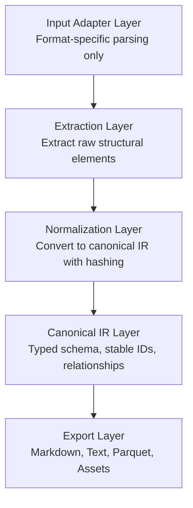

# Document IR - Production Document Ingestion Engine

**An IR-first, extensible document compiler for AI systems.**

This is NOT a PDF-to-Markdown script. It is a production-grade document ingestion and canonicalization engine designed with compiler-like architecture: Input → IR → Backends.

## Architecture

### Design Philosophy

Think like a compiler engineer:

- **Input Layer**: Format-specific parsers (currently PDF via Docling)
- **AST/IR**: Canonical intermediate representation with strict schema
- **Backends**: Multiple export formats (Markdown, Text, Parquet)

### Layer Separation (Non-Negotiable)



## Key Features

### ✅ Deterministic & Idempotent

- Hash-based stable IDs (document, block, table, image, chunk)
- Running pipeline twice produces identical output
- No UUIDs, no randomness

### ✅ Canonical IR Schema

```python
Document
├── document_id: str (hash-based)
├── schema_version: str
├── parser_version: str
├── metadata: DocumentMetadata
├── blocks: List[Block]
│   ├── block_id: str (deterministic)
│   ├── type: BlockType (heading, paragraph, table, image, etc.)
│   ├── content: str
│   ├── page_number: int
│   ├── bbox: BoundingBox
│   └── metadata: dict
└── relationships: List[Relationship]
```

### ✅ Pluggable Chunking

- `SemanticSectionChunker`: Section-based (headings)
- `TokenWindowChunker`: Fixed token windows with overlap
- `LayoutAwareChunker`: Layout-aware (stub)

All chunking operates on IR, not raw text.

### ✅ Multiple Export Formats

- **Markdown**: Human-readable with formatting
- **Plain Text**: Simple text extraction
- **Parquet**: Efficient structured storage for tables/blocks
- **Assets**: Extracted images (PNG) and tables (CSV)

### ✅ Structured Output

```
/<document_id>/
    manifest.json       # Processing metadata
    ir.json            # Canonical IR
    chunks.json        # Chunk definitions
    /assets/
        /images/       # Extracted images
        /tables/       # Tables as CSV
    /exports/
        /markdown/     # Markdown output
        /text/         # Plain text output
        /parquet/      # Parquet datasets
    /logs/             # Processing logs
```

## Installation

**IMPORTANT**: LayoutIR requires PyTorch with CUDA 13.0 support for GPU acceleration. Install PyTorch first:

```bash
# Step 1: Install PyTorch with CUDA 13.0 (REQUIRED)
pip3 install torch torchvision --index-url https://download.pytorch.org/whl/cu130

# Step 2: Install LayoutIR
pip install layoutir
```

### Alternative Installation Methods

```bash
# Install from source
git clone https://github.com/RahulPatnaik/layoutir.git
cd layoutir
pip3 install torch torchvision --index-url https://download.pytorch.org/whl/cu130
pip install -e .
```

**Note**: The package intentionally does not include PyTorch in its base dependencies to ensure you get the correct CUDA version. Any existing PyTorch installation will be overwritten by the CUDA 13.0 version.

## Usage

### Basic Usage

```bash
# Using the CLI
layoutir --input file.pdf --output ./out

# Or using Python directly
python -m layoutir.cli --input file.pdf --output ./out
```

### Advanced Options

```bash
# Semantic chunking (default)
layoutir --input file.pdf --output ./out --chunk-strategy semantic

# Token-based chunking with custom size
layoutir --input file.pdf --output ./out \
  --chunk-strategy token \
  --chunk-size 1024 \
  --chunk-overlap 128

# Enable GPU acceleration
layoutir --input file.pdf --output ./out --use-gpu

# Debug mode with structured logging
layoutir --input file.pdf --output ./out \
  --log-level DEBUG \
  --structured-logs
```

### Python API

```python
from pathlib import Path
from layoutir import Pipeline
from layoutir.adapters import DoclingAdapter
from layoutir.chunking import SemanticSectionChunker

# Create pipeline
adapter = DoclingAdapter(use_gpu=True)
chunker = SemanticSectionChunker(max_heading_level=2)
pipeline = Pipeline(adapter=adapter, chunk_strategy=chunker)

# Process document
document = pipeline.process(
    input_path=Path("document.pdf"),
    output_dir=Path("./output")
)

# Access results
print(f"Extracted {len(document.blocks)} blocks")
print(f"Document ID: {document.document_id}")
```

## Project Structure

```
src/layoutir/
├── schema.py              # Canonical IR schema (Pydantic)
├── pipeline.py            # Main orchestrator
│
├── adapters/              # Input adapters
│   ├── base.py           # Abstract interface
│   └── docling_adapter.py # PDF via Docling
│
├── extraction/            # Raw element extraction
│   └── docling_extractor.py
│
├── normalization/         # IR normalization
│   └── normalizer.py
│
├── chunking/              # Chunking strategies
│   └── strategies.py
│
├── exporters/             # Export backends
│   ├── markdown_exporter.py
│   ├── text_exporter.py
│   ├── parquet_exporter.py
│   └── asset_writer.py
│
└── utils/
    ├── hashing.py        # Deterministic ID generation
    └── logging_config.py  # Structured logging

ingest.py                  # CLI entrypoint
benchmark.py               # Performance benchmark
test_pipeline.py           # Integration test
```

## Design Constraints

### ✅ What We DO

- Strict layer separation
- Deterministic processing
- Schema validation
- Pluggable strategies
- Observability/timing
- Efficient storage (Parquet)

### ❌ What We DON'T DO

- Mix business logic into adapters
- Hardcode paths or configurations
- Use non-deterministic IDs (UUIDs)
- Combine IR and export logic
- Skip schema validation
- Load entire files into memory unnecessarily

## Extensibility

### Adding New Input Formats

1. Implement `InputAdapter` interface:

```python
class DocxAdapter(InputAdapter):
    def parse(self, file_path: Path) -> Any: ...
    def supports_format(self, file_path: Path) -> bool: ...
    def get_parser_version(self) -> str: ...
```

2. Implement corresponding extractor
3. Update pipeline to use new adapter

### Adding New Chunk Strategies

```python
class CustomChunker(ChunkStrategy):
    def chunk(self, document: Document) -> List[Chunk]:
        # Operate on IR blocks
        ...
```

### Adding New Export Formats

```python
class JsonExporter(Exporter):
    def export(self, document: Document, output_dir: Path, chunks: List[Chunk]):
        # Export from canonical IR
        ...
```

## Performance

Designed to handle 200+ page PDFs efficiently:

- Streaming processing where possible
- Lazy loading of heavy dependencies
- GPU acceleration support
- Parallel export operations
- Efficient Parquet storage for tables

## Observability

- Structured JSON logging
- Stage-level timing metrics
- Extraction statistics
- Deterministic output for debugging

## Schema Versioning

Current schema version: `1.0.0`

Future schema changes will be tracked via semantic versioning:

- Major: Breaking changes to IR structure
- Minor: Backwards-compatible additions
- Patch: Bug fixes

## Future Enhancements

- [ ] DOCX input adapter
- [ ] HTML input adapter
- [ ] Advanced layout-aware chunking
- [ ] Parallel page processing
- [ ] Incremental updates (only reprocess changed pages)
- [ ] Vector embeddings export
- [ ] OCR fallback for scanned PDFs

## License

See project root for license information.

## Contributing

This is a research/prototype phase project. See main project README for contribution guidelines.

# layoutir

# bash-tool

Generic bash tool for AI agents, compatible with [AI SDK](https://ai-sdk.dev/).

## Installation

```bash
npm install bash-tool just-bash
```

For full VM support, install [`@vercel/sandbox`](https://vercel.com/docs/vercel-sandbox) or another sandbox product instead of `just-bash`.

## Usage

```typescript
import { createBashTool } from "bash-tool";
import { ToolLoopAgent, stepCountIs } from "ai";

const { tools } = await createBashTool({
  files: {
    "src/index.ts": "export const hello = 'world';",
    "package.json": '{"name": "my-project"}',
  },
});

const agent = new ToolLoopAgent({
  model: yourModel,
  tools,
  // Or use just the bash tool as tools: {bash: tools.bash}
  stopWhen: stepCountIs(20),
});

const result = await agent.generate({
  prompt: "Analyze the project and create a summary report",
});
```

## Tools

The `tools` object contains three tools that can be used by AI agents:

### `bash`

Execute bash commands in the sandbox environment. For analysis agents, this may be the only tool you need to give to the agent.

**Input:**

- `command` (string): The bash command to execute

**Returns:**

- `stdout` (string): Standard output from the command
- `stderr` (string): Standard error from the command
- `exitCode` (number): Exit code of the command

### `readFile`

Read the contents of a file from the sandbox.

**Input:**

- `path` (string): The path to the file to read

**Returns:**

- `content` (string): The file contents

### `writeFile`

Write content to a file in the sandbox. Creates parent directories if needed.

**Input:**

- `path` (string): The path where the file should be written
- `content` (string): The content to write to the file

**Returns:**

- `success` (boolean): `true` if the write succeeded

## Advanced Usage

### Upload a local directory

```typescript
const { bash } = await createBashTool({
  uploadDirectory: {
    source: "./my-project",
    include: "**/*.{ts,json}", // optional glob filter
  },
});
```

### Use [@vercel/sandbox](https://vercel.com/docs/vercel-sandbox) for full VM

```typescript
import { Sandbox } from "@vercel/sandbox";

const sandbox = await Sandbox.create();
// Files are written to ./workspace by default
const { tools } = await createBashTool({
  sandbox,
  files: { "index.ts": "console.log('hello');" },
});
```

### Persistent sandbox across serverless invocations

Use `Sandbox.get` to reconnect to an existing sandbox by ID:

```typescript
import { Sandbox } from "@vercel/sandbox";

// First invocation: create sandbox and store the ID
const newSandbox = await Sandbox.create();
const sandboxId = newSandbox.sandboxId;
// Store sandboxId in database, session, or return to client

// Subsequent invocations: reconnect to existing sandbox
const existingSandbox = await Sandbox.get({ sandboxId });
const { tools } = await createBashTool({ sandbox: existingSandbox });
// All previous files and state are preserved
```

### Use a custom just-bash instance

```typescript
import { Bash } from "just-bash";

const sandbox = new Bash({ cwd: "/app" });
const { tools } = await createBashTool({
  sandbox,
  destination: "/app",
});
```

### Intercept bash commands

```typescript
const { tools } = await createBashTool({
  onBeforeBashCall: ({ command }) => {
    console.log("Running:", command);
    // Optionally modify the command
    if (command.includes("rm -rf")) {
      return { command: "echo 'Blocked dangerous command'" };
    }
  },
  onAfterBashCall: ({ command, result }) => {
    console.log(`Exit code: ${result.exitCode}`);
    // Optionally modify the result
    return { result: { ...result, stdout: result.stdout.trim() } };
  },
});
```

### Custom sandbox implementation

```typescript
import { createBashTool, Sandbox } from "bash-tool";

const customSandbox: Sandbox = {
  async executeCommand(command) {
    // Your implementation here
    return { stdout: "", stderr: "", exitCode: 0 };
  },
  async readFile(path) {
    // Your implementation here
    return "";
  },
  async writeFiles(files) {
    // Your implementation here - files is Array<{path, content}>
  },
};

const { tools } = await createBashTool({ sandbox: customSandbox });
```

## Skills (Experimental)

[Skills](https://platform.claude.com/docs/en/agents-and-tools/agent-skills/overview) are modular capabilities that extend agent functionality. Each skill is a directory containing a `SKILL.md` file with instructions and optional scripts.

```typescript
import {
  experimental_createSkillTool as createSkillTool,
  createBashTool,
} from "bash-tool";
import { ToolLoopAgent } from "ai";

// Discover skills and get files to upload
const { skill, files, instructions } = await createSkillTool({
  skillsDirectory: "./skills",
});

// Providing a bash tool with skills is optional if your skill only has a SKILL.md file
// and no further files and scripts.
const { tools } = await createBashTool({
  files,
  extraInstructions: instructions,
});

// Use both tools with an agent
const agent = new ToolLoopAgent({
  model,
  tools: { skill, ...tools },
});
```

[Full Example](./examples/skills-tool/) and see [Skills.sh for a directory of publicly available skills.](https://skills.sh/)

### Skill Directory Structure

```text
skills/
├── csv/
│   ├── SKILL.md         # Required: instructions with YAML frontmatter
│   └── scripts/         # Optional: scripts the agent can run
│       ├── analyze.sh
│       └── filter.sh
└── text/
    ├── SKILL.md
    └── scripts/
        └── search.sh
```

See the [example skills](./examples/skills-tool/skills/) for a complete reference.

## AI Agent Instructions

For AI agents working with bash-tool, additional guidance is available in `AGENTS.md`:

```bash
cat node_modules/bash-tool/dist/AGENTS.md
```

## License

MIT
