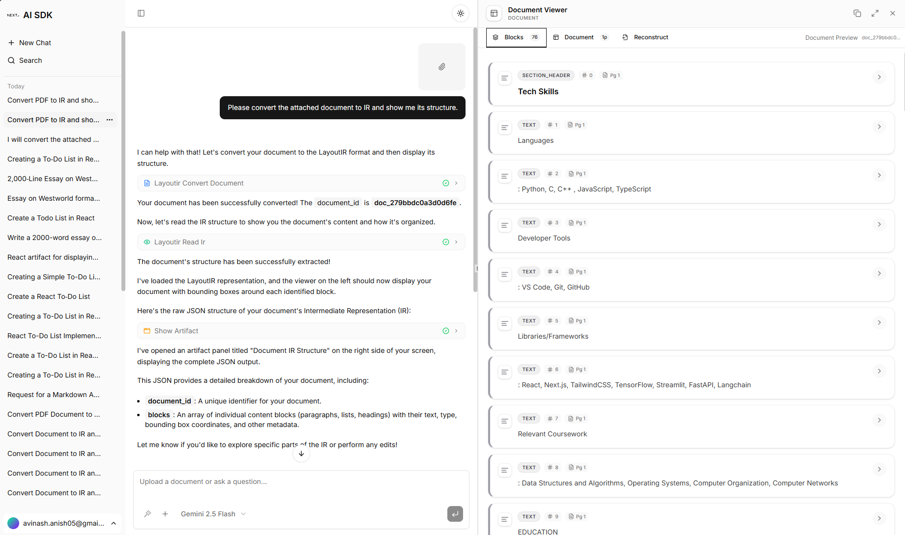

# LayoutIR Agent

## Project Structure

- **`frontend/`**: A Next.js 15 application using the Vercel AI SDK, Shadcn UI, and Tailwind CSS.
- **`backend/`**: A Python-based MCP (Model Context Protocol) server that handles document conversion, IR manipulation, and PDF reconstruction using the `layoutir` library.



## Quick Start

### 1. Prerequisites

- **Runtimes**: Node.js 20+ & Python 3.12+
- **Package Managers**: npm & [uv](https://github.com/astral-sh/uv)
- **Service Accounts**:
  - [Supabase](https://supabase.com/) (Database & Storage)
  - [Resend](https://resend.com/) (Email notifications)
  - AI Providers: [OpenAI](https://platform.openai.com/), [Google Gemini](https://aistudio.google.com/)

### 2. Supabase Setup

- Create a new project at [Supabase](https://supabase.com/).
- Run the SQL migration script located at `frontend/lib/supabase/migrations/schema.sql` in the Supabase SQL Editor.

### 3. Backend Setup

```bash
cd backend
cp .env.example .env  # Fill in Supabase credentials
uv run .\run_server.py
```

### 4. Frontend Setup

```bash
cd frontend
cp env.example .env.local  # Fill in AI keys and Supabase credentials
npm install
npm run dev
```

## Key Features

- **Convert**: Upload any PDF to transform it into a structured LayoutIR JSON.
- **Visualize**: Interactive document viewer with bounding boxes and hierarchical block views.
- **Edit**: Grantular control over every block's text, type, and position.
- **Export**: Reconstruction back to PDF or Markdown.
